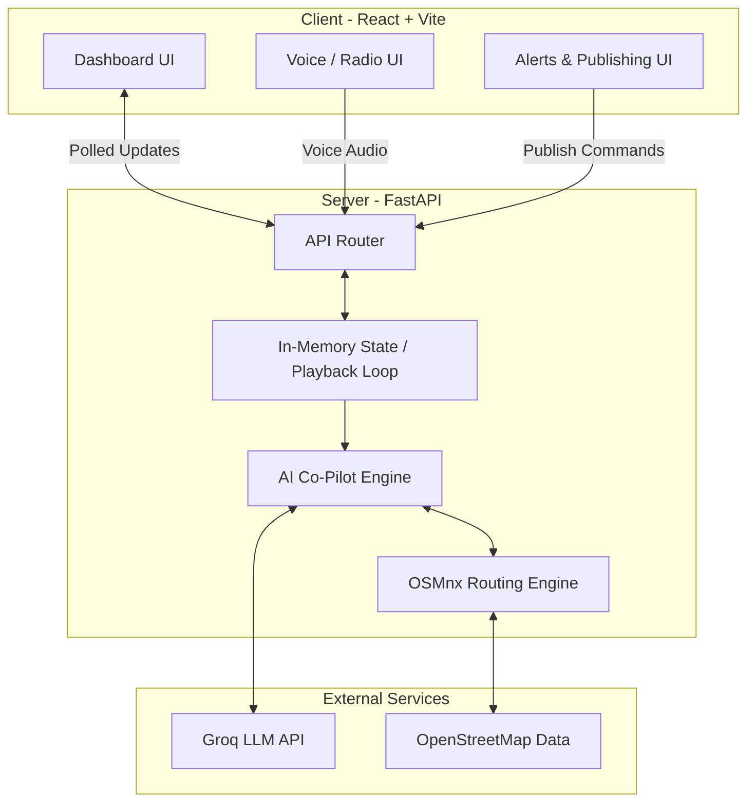

# 🚦 MargDarshak

> **An AI-powered Traffic Operations & Incident Co-Pilot for Gandhinagar**

MargDarshak is a next-generation urban traffic command center platform. It intelligently simulates live traffic feeds, automatically detects incidents, and provides operators with real-time, LLM-generated guidance (including signal retiming, diversion routes, and public alerts).

## ✨ Key Features
- **Live Traffic Playback**: Ingests and replays timestamped road-segment telemetry.
- **Intelligent Incident Detection**: Tracks `ACCIDENT` and `ROAD_CLOSED` events in a shared state.
- **AI Co-Pilot**: Utilizes Groq LLM to instantly generate signal retiming plans, diversion text, and public alerts.
- **Real-Time Routing**: Computes dynamic diversion candidates on an OSMnx + NetworkX road graph using BPR-weighted edge travel times.
- **Multi-Channel Publishing**: Seamlessly pushes alerts to VMS, radio, and social platforms.
- **Voice-Triggered Reporting**: Enables hands-free incident creation via audio transcription.

---

## 🏗️ System Architecture

Below is the high-level architecture of MargDarshak, illustrating the flow between the Vite/React frontend, the FastAPI backend, and external AI routing services.



---

## 💻 Tech Stack

- **Frontend**: React 18, Vite, Tailwind CSS, Lucide Icons
- **Backend**: Python 3.11, FastAPI, Uvicorn, Pandas
- **AI & Routing**: Groq (Llama-3.1), OSMnx, NetworkX
- **Deployment**: Ready for Vercel (Frontend) and scalable cloud hosting (Backend)

---

## 🚀 Getting Started

### 1. Backend Setup

The backend handles the simulation loop, routing, and AI generation.

```bash
cd server
python3 -m venv .venv
source .venv/bin/activate
pip install fastapi uvicorn pandas python-dotenv tweepy python-multipart groq osmnx networkx

# Set up your environment variables
echo "GROQ_API_KEY=your_key_here" > .env

# Run the backend
uvicorn api:app --host 0.0.0.0 --port 8000 --reload
```
*(Make sure to run the server from the `server` directory so the CSV and graph cache resolve correctly).*

### 2. Frontend Setup

The frontend is a modern React SPA.

```bash
cd client
npm install
npm run dev
```

Open `http://localhost:5173` to view the dashboard!

---

## ☁️ Deployment Note (Vercel)

The `client` directory is fully optimized for Vercel deployment. You can connect your GitHub repository to Vercel, set the **Root Directory** to `client/`, and Vercel will automatically detect the Vite framework and handle the build (`npm run build`). Just be sure to set your production backend URL (e.g., `VITE_API_URL`) in your Vercel project environment variables!